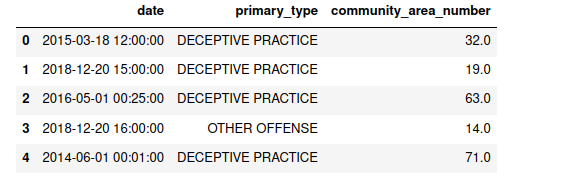

├── config

│── config.yml

└── rename_columns.json

├── data

├── docs

├── LICENSE

├── main_api.py

├── main.py

├── Makefile

├── models

├── notebooks

├── README.md

├── reports

├── requirements.txt

├── setup.py

├── src

├── test_environment.py

├── tests

└── tox.ini

# Projet sur les Crimes à Chicago

## Description
Ce projet analyse les données sur les crimes à Chicago dans 
le but de prédire les tendances criminelles et de fournir 
des insights pour la prévention. 
Il utilise des données historiques pour identifier les modèles et
les hotspots de criminalité.

## Méthode de prédiction :
  

La collecte des données sur les crimes est organisée de manière,
où chaque incident est classifié non seulement par région, mais aussi chronologiquement par mois.
Cette approche transforme le nombre de crimes en une série temporelle,
permettant ainsi une analyse des tendances et des modèles dans le temps. 
Pour prédire l'évolution future de ces tendances, nous utilisons un outil avancé nommé Prophet, 
disponible sur PyPI. 
Prophet se distingue par sa capacité à gérer les changements saisonniers et les jours fériés, 
offrant ainsi des prédictions robustes et fiables, cruciales pour une planification stratégique et
une allocation efficace des ressources dans la lutte contre la criminalité.

## Organisation du code 
### Méthodes de la Classe

Cette classe est constituée des méthodes suivantes :

- `load_df_crimes`: Charge les données sur les crimes depuis un fichier CSV.
- `load_df_socio`: Charge les données socio-économiques depuis un fichier CSV.
- `return_data`: Prépare et retourne les données pour l'entraînement et le test du modèle.
- `model_evaluation`: Évalue le modèle sur les données de test.
- `model_predict`: Effectue des prédictions en utilisant le modèle entraîné.
- `model_save`: Sauvegarde le modèle entraîné dans un fichier.
- `model_train`: Entraîne le modèle Prophet sur les données fournies.
- `model_visualization`: Visualise les données d'entraînement, de test et les prédictions.

## source des données 
- https://data.cityofchicago.org/Public-Safety/Crimes-2001-to-Present/ijzp-q8t2/data_preview
- https://data.cityofchicago.org/Health-Human-Services/Census-Data-Selected-socioeconomic-indicators-in-C/kn9c-c2s2/data_preview

## Installation
### Prérequis
- Python 3.9
- bibliothèque pandas
- bibliothèque scikit-learn
- bibliothèque Prophet

### Setup

- git clone git@github.com:mlouarra/Chicago_Crime.git
- cd projet_crime_chicago
- pip install -r requirements.txt

## execution du code

Le code contient deux scripts sous la racine :

- `main.py` : Ce script peut être exécuté via la commande `python main.py`.
- `main_api.py` : Ce script peut être exécuté via la commande `python main_api.py`.

